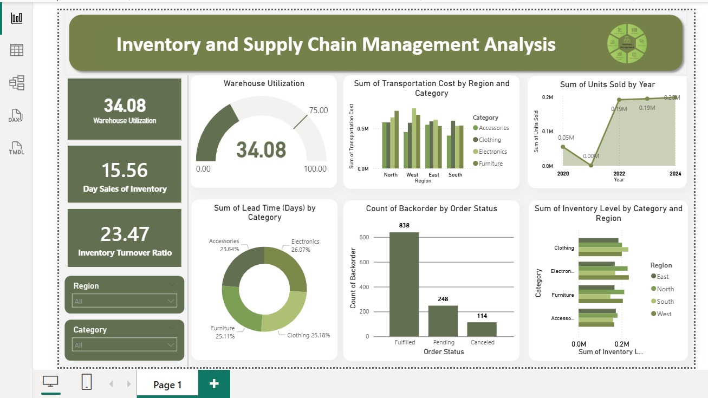

# Supply Chain Performance & Inventory Optimization Dashboard (Power BI)

This project is my second Power BI dashboard focused on analyzing supply chain operations and inventory performance. The goal is to transform raw operational data into actionable insights that support efficient and data-driven decision-making.

## Objective
To analyze supply chain data and identify inefficiencies in inventory management, transportation, and order fulfillment to improve overall operational performance.

## Business Context
In real-world supply chain systems, inefficiencies in inventory planning, transportation, and demand forecasting can lead to increased costs and delays. This project simulates such scenarios and aims to provide insights that help improve operational efficiency and resource utilization.

## Dataset
The dataset used in this project simulates real-world supply chain operations and includes:

- Order and sales data  
- Product and category details  
- Inventory levels and stock movement  
- Supplier and logistics information  
- Transportation cost and lead time  
- Order status and backorders  

## Dashboard Preview

## Key KPIs
- **Warehouse Utilization (%)**  
- **Inventory Turnover Ratio**  
- **Days of Inventory (Days)**  
- **Total Sales & Orders**  

## Key Metrics (DAX)
The following KPIs were created using DAX:

- Inventory Turnover Ratio  
- Days of Inventory  
- Warehouse Utilization (%)  
- Total Sales and Orders  
- Fill Rate (%) *(Advanced KPI)*  

These metrics help evaluate operational efficiency, demand fulfillment, and inventory performance.

## Analysis Performed

- Inventory tracking and stock level analysis  
- Supplier and transportation performance evaluation  
- Demand trends and sales analysis over time  
- Backorder and order fulfillment monitoring  
- Region-wise and category-wise performance comparison  

## Key Insights

- Higher transportation costs observed in certain regions, indicating optimization opportunities  
- Inventory turnover suggests moderate product movement with scope for improvement  
- Backorders highlight demand-supply gaps in specific product categories  
- Sales trends vary across years, indicating seasonal demand patterns  
- Warehouse utilization suggests potential for better capacity planning  

## Business Challenges Identified

- Inefficient inventory distribution across regions  
- Increased transportation cost in specific supply routes  
- Delayed order fulfillment due to stock shortages  
- Demand variability impacting inventory planning  

## Recommendations

- Optimize inventory allocation based on demand patterns  
- Improve supplier coordination to reduce lead time  
- Monitor high-cost regions to reduce transportation expenses  
- Implement better forecasting techniques for demand planning  

## Project Workflow

1. Data cleaning using Power Query  
2. Data modeling and relationship creation  
3. KPI calculation using DAX  
4. Dashboard design and visualization  
5. Insight generation and business analysis  

## Tools Used

- Power BI  
- DAX (Data Analysis Expressions)  
- Power Query (Data Cleaning & Transformation)  

## Features

- Interactive dashboard with slicers (Region, Category)  
- KPI cards for performance tracking  
- Time-based trend analysis  
- Multi-dimensional analysis (Region, Product, Supplier)  

## Skills Demonstrated

- Data Cleaning  
- Data Modeling  
- Data Visualization  
- Business Analysis  
- KPI Development using DAX  

## Conclusion

This project demonstrates how supply chain data can be transformed into actionable insights using Power BI. It highlights key operational inefficiencies and provides a foundation for data-driven decision-making in supply chain management.
